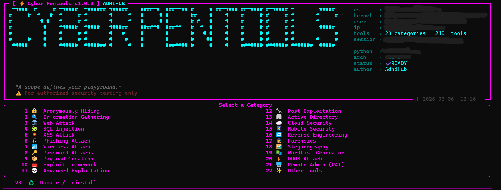

# 🔥 Cyber Pentools — All-in-One Penetration Testing Toolkit



**240+ hacking tools** organized into **22 categories** — information gathering, web exploitation, wireless attacks, password cracking, forensics, reverse engineering, C2 frameworks, and more.


---

## 🚀 Quick Install

```bash
git clone https://github.com/AdhiHub/cyber-pentools.git
cd cyber-pentools
sudo python3 install.py
```

Then run:
```bash
pentools
```

### One-liner (Linux/macOS)
```bash
curl -sSL https://raw.githubusercontent.com/AdhiHub/cyber-pentools/main/install.py | sudo python3
```

---

## 📂 Tool Categories

| # | Category | Tools |
|---|----------|-------|
| 1 | 🔒 Anonymously Hiding | anonsurf, multitor |
| 2 | 🔍 Information Gathering | nmap, masscan, rustscan, theHarvester, amass, subfinder, spiderfoot, gau, gospider, naabu, whatweb, searchsploit, enum4linux, smbmap, sn1per, legion, reconFTW + 25 more |
| 3 | 🌐 Web Attack | nuclei, ffuf, feroxbuster, nikto, gobuster, wpscan, joomscan, katana, owasp zap, caido, mitmproxy, testssl, drupwn, arjun + 22 more |
| 4 | 🧩 SQL Injection | sqlmap, nosqlmap, dsss, explo, blisqy, leviathan, sqlscan |
| 5 | 💥 XSS Attack | dalfox, xsstrike, xspear, rvuln, xsscon, xss-freak + 8 more |
| 6 | 🎣 Phishing Attack | setoolkit, socialfish, hiddeneye, evilginx, blackeye, shellphish, maskphish, dnstwist + 16 more |
| 7 | 📶 Wireless Attack | wifiphisher, wifite, fluxion, airgeddon, bettercap, hcxdumptool + 12 more |
| 8 | 🔑 Password Attacks | hydra, medusa, lazagne, rubeus, mimikatz, sprayingtoolkit, domainpasswordspray, asreproast + 16 more |
| 9 | 📦 Payload Creation | thefatrat, msfpc, venom, stitch, enigma + 8 more |
| 10 | 🧰 Exploit Framework | routersploit, websploit, commix, web2attack |
| 11 | 💀 Advanced Exploitation & C2 | metasploit, burpsuite, beef, empire, starkiller, merlin, covenant, silenttrinity, hackthebox, tryhackme |
| 12 | 🔧 Post Exploitation | pwncat, sliver, havoc, peass, ligolo, chisel, evil-winrm, mythic + 10 more |
| 13 | 🏢 Active Directory | bloodhound, netexec, impacket, responder, certipy, kerbrute |
| 14 | ☁ Cloud Security | prowler, scoutsuite, pacu, trivy |
| 15 | 📱 Mobile Security | mobsf, frida, objection |
| 16 | 🔁 Reverse Engineering | ghidra, radare2, jadx, androguard, apk2gold |
| 17 | 🕵 Forensics | wireshark, volatility3, binwalk, autopsy, bulk_extractor, pspy + 8 more |
| 18 | 🖼 Steganography | steghide, stegcracker |
| 19 | 📚 Wordlist Generator | cupp, crunch, cewl, hashcat, john, haiti, psudohash, mentalist + 10 more |
| 20 | ⚡ DDOS Attack | slowloris, ufonet, goldeneye, saphyra, asyncrone |
| 21 | 🐀 Remote Admin (RAT) | pyshell |
| 22 | ✨ Other Tools | social media, android, hash cracking, wifi jamming + 10 more |

---

## 🧭 How to Use

1. **Navigate** — Enter the number of a category to open it
2. **Select** — Pick a tool by its number
3. **Install** — Option 1 installs the tool automatically
4. **Run** — Option 2 launches the tool
5. **Back** — Press `77` or `b` to go back to the previous menu
6. **Search** — Type `/<query>` to search all tools
7. **Filter** — Press `t` to filter by tags (osint, web, scanner, etc.)
8. **Recommend** — Press `r` to get tool recommendations for your task

```
  ╰─> 7        ← open Web Attack category
  ╰─> 3        ← select nuclei
  ╰─> 1        ← install
  ╰─> 77 / b   ← go back
```

---

## 🔍 Search & Tag System

- **Search**: Type `/subdomain` to instantly find all subdomain enumeration tools
- **Tags**: Press `t` to browse by tag — osint, scanner, bruteforce, web, wireless, c2, cloud, mobile, etc.
- **Recommend**: Press `r`, pick a task, and get curated tool suggestions

---

## ⚙ Requirements

- **OS**: Linux (primary) / macOS (partial)
- **Python**: 3.10+
- **Python packages**: `rich`, `requests`
- **System**: git, curl, wget, go (optional), ruby (optional)

---

## 📦 Features

- **240+ tools** across 22 categories
- **One-command install** — dependencies, venv, and launcher
- **Smart search** — `/query` to find tools instantly
- **Back navigation** — `b` or `77` to go back at any menu
- **Tag filtering** — filter by osint, scanner, web, c2, credentials, and more
- **Task recommendations** — tell it what you want to do, get tool suggestions
- **Install all** — batch install all tools in a category
- **Auto-update** — git pull, pip upgrade, and go install detection
- **Archived tools** — preserved but flagged as unmaintained
- **OS-aware** — automatically hides incompatible tools
- **C2 & Exploitation Frameworks** — metasploit, burpsuite, beef, empire, sliver, covenant, merlin

---

## 🛠 Complete Tool Reference

### 1. 🔒 Anonymously Hiding
| Tool | Description |
|------|-------------|
| AnonSurf | Route all traffic through Tor |
| MultiTor | Multi-Tor proxy chains |

### 2. 🔍 Information Gathering (37 tools)
| Tool | Description |
|------|-------------|
| Nmap | Network discovery and security scanning |
| Masscan | Fastest TCP port scanner |
| RustScan | Lightning-fast port scanner with Nmap integration |
| TheHarvester | OSINT email/subdomain enumeration |
| Amass | In-depth DNS enumeration and OSINT |
| Subfinder | Fast passive subdomain enumeration |
| SpiderFoot | Automated OSINT reconnaissance |
| Httpx | HTTP probe for live domain detection |
| Gau | Fetch known URLs from OTX/Wayback/Crawls |
| GoSpider | Fast web spider in Go |
| Naabu | Fast port scanner by ProjectDiscovery |
| WhatWeb | CMS/tech stack fingerprinting |
| Searchsploit | Exploit-Database search from terminal |
| Enum4Linux | Windows/Samba enumeration |
| SMBMap | SMB share and ACL enumeration |
| Sn1per | Automated pentest scanner |
| Legion | Graphical automated pentest framework |
| ReconFTW | Full recon workflow automation |
| Dracnmap | Nmap automation script |
| PortScan | Port scanning utility |
| Host2IP | Resolve hostnames to IPs |
| XeroSploit | MITM/network attack toolkit |
| RedHawk | All-in-one information gathering |
| ReconSpider | Multi-threaded recon engine |
| IsItDown | Website uptime checker |
| Infoga | Email OSINT tool |
| ReconDog | All-in-one recon tool |
| Striker | Multi-purpose recon/fuzzer |
| SecretFinder | Find API keys/secrets in JS |
| Shodan | Shodan search API client |
| Breacher | Hidden directory/file discovery |
| Holehe | Check email for registered accounts |
| Maigret | Username search across social networks |
| TruffleHog | Git secret scanning |
| Gitleaks | Git repository secret scanner |

### 3. 🌐 Web Attack (23 tools)
| Tool | Description |
|------|-------------|
| Nuclei | Template-based vulnerability scanner |
| Ffuf | Fast web fuzzer |
| Feroxbuster | Rust directory brute-forcer |
| Nikto | Web server scanner |
| WPScan | WordPress vulnerability scanner |
| JoomScan | Joomla vulnerability scanner |
| Drupwn | Drupal security scanner |
| Gobuster | Dir/DNS/vhost brute-force |
| Dirsearch | Web path discovery |
| Katana | Next-gen web crawler |
| OwaspZap | Full web app security scanner |
| Caido | Modern web auditing toolkit |
| Mitmproxy | TLS-intercepting HTTP proxy |
| TestSSL | TLS/SSL configuration checker |
| Arjun | HTTP parameter discovery |
| Wafw00f | WAF fingerprinting |
| Dirb | Dictionary-based content scanner |
| Skipfish | Automated web recon |
| SubDomainFinder | OSINT subdomain enumeration |
| CheckURL | IDN homograph attack detection |
| Blazy | Login page brute-forcer |
| SubDomainTakeOver | Subdomain takeover detection |
| Web2Attack | Web hacking framework |

### 4. 🧩 SQL Injection (7 tools)
| Tool | Description |
|------|-------------|
| Sqlmap | Automatic SQL injection detection/exploitation |
| NoSqlMap | NoSQL injection audit tool |
| DSSS | Damn Small SQLi Scanner |
| Explo | YAML-based web security test cases |
| Blisqy | Time-based blind SQLi on headers |
| Leviathan | Mass audit toolkit with SQLi detection |
| SQLScan | Quick web SQLi scanner |

### 5. 💥 XSS Attack (9 tools)
| Tool | Description |
|------|-------------|
| DalFox | XSS parameter analysis/scanner |
| XSStrike | Advanced XSS detection suite |
| XSpear | Ruby-based XSS scanner |
| RVuln | Rust vulnerability scanner |
| XSS-Freak | Python3 XSS scanner |
| XSSCon | XSS scanning tool |
| XanXSS | Reflected XSS search tool |
| XSS Payload Gen | Payload/dork generator |
| Extended XSS Search | XSS finder framework |

### 6. 🎣 Phishing Attack (17 tools)
| Tool | Description |
|------|-------------|
| Setoolkit | Social Engineer Toolkit |
| SocialFish | Automated phishing with 77 templates |
| HiddenEye | Phishing with tunneling services |
| Evilginx3 | MITM phishing framework |
| BlackEye | 38 phishing page templates |
| ShellPhish | Phishing for 18 social media |
| Maskphish | URL masking/hiding |
| Dnstwist | Domain typosquatting detection |
| Autophisher | Automated phishing toolkit |
| Pyphisher | Easy phishing with templates |
| AdvPhishing | Advanced phishing with OTP |
| ISeeYou | Location tracking via social engineering |
| SayCheese | Webcam capture via malicious link |
| QRJacking | QR code login hijacking |
| Thanos | Browser-to-browser phishing |
| QRLJacking | QR login session hijacking |
| BlackPhish | Phishing framework |

### 7. 📶 Wireless Attack (13 tools)
| Tool | Description |
|------|-------------|
| WiFi-Pumpkin | Rogue AP framework |
| pixiewps | WPS offline brute-force (pixie dust) |
| Fluxion | Evil twin attack automation |
| Wifiphisher | Rogue AP social engineering |
| Wifite | Automated wireless attack tool |
| EvilTwin | Fake AP credential harvesting |
| Airgeddon | Multi-use wireless audit suite |
| Hcxdumptool | PMKID hash capture |
| Hcxtools | WLAN packet to hash converter |
| Bettercap | WiFi/BLE/Ethernet MITM framework |
| BluePot | Bluetooth honeypot framework |
| Howmanypeople | WiFi device counter |
| Fastssh | Multi-threaded SSH brute-force |

### 8. 🔑 Password Attacks (18 tools)
| Tool | Description |
|------|-------------|
| Hydra | Parallel network login cracker |
| Medusa | Parallel login auditor |
| LaZagne | Stored password recovery |
| Rubeus | Kerberos abuse toolkit |
| Mimikatz | Windows credential dumper |
| SprayingToolkit | OWA/O365 password spray |
| DomainPasswordSpray | AD password spray tool |
| ASREPRoast | Kerberos pre-auth attack |
| CeWL | Website wordlist generator |
| Crunch | Custom wordlist generator |
| Psudohash | Keyword password mutation |
| Mentalist | Wordlist mutation GUI |
| PACK | Statsgen/maskgen/policygen |
| Statsgen | Password statistics |
| Maskgen | Hashcat mask generator |
| Policygen | Password policy generator |
| SearchPass | Pattern password search |
| TiKNR | Password mutator |

### 9. 📦 Payload Creation (8 tools)
| Tool | Description |
|------|-------------|
| TheFatRat | AV-evading backdoor generator |
| Brutal | Payload/HID attack toolkit |
| Stitch | Cross-platform RAT generator |
| MSFVenom PC | MSFvenom wrapper for payloads |
| Venom | Shellcode generator |
| Spycam | Webcam capture payload |
| Mob-Droid | Metasploit payload generator |
| Enigma | Multiplatform payload dropper |

### 10. 🧰 Exploit Framework (4 tools)
| Tool | Description |
|------|-------------|
| RouterSploit | Embedded device exploitation |
| WebSploit | MITM framework |
| Commix | Automated command injection |
| Web2Attack | Web exploitation framework |

### 11. 💀 Advanced Exploitation & C2 (10 tools)
| Tool | Description |
|------|-------------|
| Metasploit Framework | World's #1 penetration testing framework |
| Burp Suite Community | Web security testing platform |
| BeEF | Browser exploitation framework |
| Empire | PowerShell post-exploitation C2 |
| Starkiller | Empire GUI |
| Merlin | HTTP/HTTPS C2 framework |
| Covenant | ASP.NET Core C2 framework |
| SILENTTRINITY | Python C2 with IronPython agent |
| HackTheBox | CTF/practice platform CLI |
| TryHackMe | Browser-based security training |

### 12. 🔧 Post Exploitation (10 tools)
| Tool | Description |
|------|-------------|
| Pwncat-cs | Reverse shell handler/automation |
| Sliver | Adversary emulation C2 framework |
| Havoc | Modern C2 with EDR evasion |
| PEASS-ng | LinPEAS/WinPEAS priv-esc enumeration |
| Ligolo-ng | TUN-based pivoting/tunneling |
| Chisel | HTTP tunnel for pivoting |
| Evil-WinRM | WinRM shell for Windows |
| Mythic | Multi-payload C2 platform |
| Vegile | Backdoor/rootkit hider |
| ChromeKeyLogger | Chrome keylogger |

### 13. 🏢 Active Directory (6 tools)
| Tool | Description |
|------|-------------|
| BloodHound | AD attack path mapping |
| NetExec (nxc) | Network pentesting (CrackMapExec successor) |
| Impacket | SMB/MSRPC/Kerberos protocol tools |
| Responder | LLMNR/NBT-NS/MDNS poisoner |
| Certipy | AD CS enumeration/abuse |
| Kerbrute | Kerberos pre-auth brute-force |

### 14. ☁ Cloud Security (4 tools)
| Tool | Description |
|------|-------------|
| Prowler | AWS/Azure/GCP security scanner |
| ScoutSuite | Multi-cloud auditing |
| Pacu | AWS exploitation framework |
| Trivy | Container/K8s/IaC scanner |

### 15. 📱 Mobile Security (3 tools)
| Tool | Description |
|------|-------------|
| MobSF | Mobile app pentesting framework |
| Frida | Dynamic instrumentation toolkit |
| Objection | Runtime mobile exploration |

### 16. 🔁 Reverse Engineering (5 tools)
| Tool | Description |
|------|-------------|
| Ghidra | NSA reverse engineering framework |
| Radare2 | Unix RE framework |
| Jadx | Dex-to-Java decompiler |
| AndroGuard | Android analysis/decompilation |
| Apk2Gold | Android APK to Java |

### 17. 🕵 Forensics (8 tools)
| Tool | Description |
|------|-------------|
| Wireshark | Network capture and analysis |
| Volatility3 | Memory forensics framework |
| Binwalk | Firmware analysis/extraction |
| Autopsy | Forensic investigation platform |
| BulkExtractor | Disk/file content extraction |
| Pspy | Process monitor (no root) |
| Guymager | Forensic disk imaging |
| Toolsley | Online investigation tools |

### 18. 🖼 Steganography
| Tool | Description |
|------|-------------|
| Steghide | Hide data in images/audio |
| Stegcracker | Steghide password brute-forcer |

### 19. 📚 Wordlist Generator (14 tools)
| Tool | Description |
|------|-------------|
| Cupp | Common user passwords profiler |
| Crunch | Custom character set wordlist generator |
| CeWL | Spider-based wordlist generation |
| Hashcat | World's fastest password cracker |
| John | John the Ripper password cracker |
| Haiti | Hash type identifier |
| Psudohash | Keyword-based password mutation |
| Mentalist | Graphical wordlist mutation tool |
| PACK | Statsgen/maskgen/policygen toolkit |
| SearchPass | Pattern-based password search |
| TiKNR | Password mutation tool |
| Statsgen | Password statistics analysis |
| Maskgen | Hashcat mask generator |
| Policygen | Password policy generator |

### 20. ⚡ DDOS Attack (6 tools)
| Tool | Description |
|------|-------------|
| SlowLoris | HTTP DoS attack |
| UFONet | P2P DDoS toolkit |
| GoldenEye | HTTP DoS test tool |
| Saphyra | Python DDoS script |
| DDoSTool | 36-method DDoS attack script |
| Asyncrone | SYN flood DDoS weapon |

### 21. 🐀 Remote Admin (RAT)
| Tool | Description |
|------|-------------|
| PyShell | Python-based remote administration |

### 22. ✨ Other Tools
| Tool | Description |
|------|-------------|
| SocialMedia | Social media account tools |
| Android | Android security tools |
| Hash cracking | Additional hash cracking utilities |
| WiFi Jamming | Wireless jamming tools |
| + more | Various utilities and helpers |

---

## ⚠️ Legal Disclaimer

```diff
+ This tool is provided for EDUCATIONAL PURPOSES ONLY.
+ It is intended for:
+   • Authorized security testing of your own systems
+   • Penetration testing engagements with written permission
+   • Security research in controlled environments
+
- Any unauthorized use of these tools against systems you
- do not own or have explicit permission to test is ILLEGAL.
- The developers assume NO LIABILITY for misuse.
```

By using this software, you agree to use it **only for lawful purposes** and in compliance with all applicable local, state, and federal laws.
